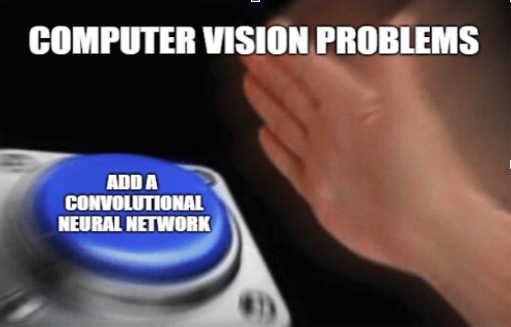
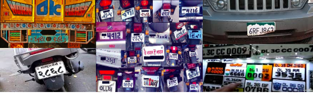

# Vehicle-Name-Plate-Detection-and-OCR

## Background

The problem statement can be easily broken down into two parts:

   1. Given an image, identify the licence plate in the image and segment it.
   2. Do Optical Character Recognition (OCR) on the image of licence plate to extract the characters in it.

## My Understanding

There are many traffic-related applications related to this problem which can be used for the technical advancement of the society. Some of the applications include:

         - Traffic Rule Violation Detector
         - Stolen Vehicle Detection
         - Automatic Parking Lot Access etc.

Many of these applications are used commercially at various places performed by Automatic Licence Plate Recognition (ALPR) systems.

There are recent advances in Parallel Processing and Deep Learning which have contributed to improve many computer vision tasks, such as Object Detection/Recognition and Optical Character Recognition, which clearly benefit ALPR systems. In fact, deep Convolutional Neural Networks have been the leading machine learning technique applied for vehicle and license plate detection and have given reasonable accuracy.

For the object Detection/Recognition, we can use various techniques such as CNN, RCNN, Fast CNN, Faster RCNN, YOLO(You Look Only Once) etc. where we draw a bounding box around the Licence Plate (LP) detected.

Whereas, For the OCR we are also available with various techniques like we can simply use already built OCR engines like Tesseract, Ocropus etc or we can build our own network to do the OCR which generally involves steps like segmentation of our LP and recognition of the characters segmented.

We need a strong accuracy in these systems in order to run them independently and at larger scale as mistakes are intolerable in this scenario. Suppose we detected a vehicle violating the traffic rule and we release automatic challan for the driver then any mistake in reading the Licence Plate of the vehicle might lead to innocent being punished and guilty left unpunished. 
	
The accuracy is not only sacrificed by the ALPR system but also because of the owner’s ill-practices  as well as the negligence towards the maintenance of proper Licence Plate such as different fonts in number plate, resembling numbers with text to form particular words etc.

## Scope

There are various elements which are being considered by my model each one is listed and explained in the points below:

- The input can be image. As per the problem statement it is mentioned to consider image, although I can very easily remove that limitation to other input sources as well.

- There can be more than one number plate in the input provided which is very useful in the practical world application.

- The Licence Plate is detected irrespective of the position of it (whether it is present in the front or at the back) and irrespective of the vehicle type ( majorly the cars and bikes).

- Various fonts can be detected from the input which is a key aspect of this model. I  used separate dataset of digits to train the model for different fonts.

- “IND” embossing if detected will be removed from the starting of the Licence Plate.

## Out of scope

There are certain elements which are not considered model and are listed below:

- Characters other than English alphabets and numbers in the Licence Plates are not recognised.

- Special Characters present in Licence Plate are not defined separately.

- Not able to differentiate between the temporary and the permanent Licence Plate.

- Not able to tell the type of Licence Plates like private (white background), commercial( yellow background and black characters) etc.

- The vehicle category is also not defined in this model failing to determine between the number plate of a motor bike or a car or any other vehicle.

- Number plate with characters in multiple line may not be detected properly. 

## Assumptions

* __General Assumptions__:
There are certain assumptions that my model takes listed below:

      - Assuming Licence Plate includes only English alphabets and numbers.

      - Assuming there can be any number of characters in the number plate.

      - Input of images only as per the Problem statement.

      - the width of characters should be between 5% and 20% in width of the license plate and height should be between 30% and 70%

      - The number of characters in the Licence Plate are aligned in a single line.

* __Technical Assumptions__:
There are no as such minimum system requirements but as I am using a Deep Learning model using a certain minimum specifications would provide better performance:

      - GPU: P100 or GeForce 10 series (e.g. GTX 1080 Ti, GTX1080), GeForce  900 series or equivalent.

      - CPU: 3.6 Ghz or more. Ex. Intel i5 processor or equivalent or higher version.

      - RAM: 8 GB or more.

      - SSD would work better for fast I/O.
   
## Solution Approach

As I work with deep learning so my solution will also be implemented using Deep Learning using Convolution Neural Networks. The problem statement can be effectively broken down into 2 parts according to my solution approach:

1. Licence Plate Detection and character segmentation.

2. Recognition of the characters of the LP.

The Model can be broken down into 2 parts:

### 1. Licence Plate detection and segmentation of characters

The first part of Licence Plate Detection is completed using YOLOv3 with darknet backbone. I used the dataset provided by TCS i.e. 237 images of cars and some bikes at different angles.

For providing the bounding boxes and annotations I have used LabelImg  which is also available in github. Steps involved in bulding dataset:

   - first have all the images in a path
   
   - then open Labelmg, draw the bounding box and save the annotation of classes in it. In my case no of classes is 1
   
   - save in the YOLO format
   
   - Run the program LINK (https://gist.github.com/ssaahhaajj/5d9e53a30bec46fdcc76cc604e890bab) in the path of folder having training and testing images

The dataset is available at https://www.floydhub.com/sahajjain/datasets/licenceplate 

Model Weights : https://drive.google.com/file/d/1qAof2POtYAInDYI7XyS4O4m5V4ByMq-b/view?usp=sharing

For the segmentation of the characters I first of all I converted my image from RGB to GRAY and then Binarize it then Closed Component( also known as Closed Component Analysis) is applied on it to bound the characters in it. 
	
                     RGB  →  GRAY  →  BINARIZATION   →   APPLYING CCA

### 2. Character Recognition

And at last for the Character prediction, I have used a pre-trained model on the english alphabets in different fonts and the numbers which just predicts the character present on the Licence Plate.

 For the improvement in the accuracy of the model I checked the presence of “IND” substring in the string formed and removed it.

##### **Apache Licence**
